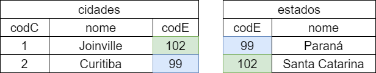

# Relacionamento 1 para N

A partir do exemplo dos slides:

Temos as duas tabelas:

    CREATE TABLE estados(
        codE INTEGER PRIMARY KEY AUTOINCREMENT,
        nome TEXT
    );

    CREATE TABLE cidades(
        codC INTEGER PRIMARY KEY AUTOINCREMENT,
        nome TEXT,
        codE INTEGER references estados
    );

A partir disso, vamos criar as classes Estado e Cidade em Dart:

    class Estado{

        int? codE;
        String? nome;
        List<Cidade> cidades = [];

        Estado();

        Estado.fromJson(Map<String, dynamic> json) {
            this.codE = json['codE'];
            this.nome = json['nome'];
        }

    }

    class Cidade{

        int? codC;
        String? nome;

        Cidade();

        Cidade.fromJson(Map<String, dynamic> json) {
            this.codC = json['codC'];
            this.nome = json['nome'];
        }

    }

Note que no construtor **fromJson()** da classe Estado, um dos parâmetros, a lista de cidades não é criado, visto que ele encontra-se em outra tabela.

E em seguida, vamos criar a classe BancoDeDados, seguindo o que foi visto nos slides, a única diferença é que vamos modificar a SQL chamada para iniciar o banco para que agora criemos as duas tabelas:

    import 'package:sqflite/sqflite.dart';

    class BancoDeDados {

        ...

        final String onCreateEstadosSQL =
            'CREATE TABLE estados(codE INTEGER PRIMARY KEY AUTOINCREMENT,nome TEXT';

        final String onCreateCidadesSQL = 'CREATE TABLE cidades(codC INTEGER PRIMARY KEY AUTOINCREMENT, nome TEXT, codE INTEGER references estados);';

        onCreateFunction(Database db, int version) {
            db.execute(onCreateEstadosSQL);
            db.execute(onCreateCidadesSQL);
        }

        ...

    }

Note que agora executamos duas vezes o método **execute()**.

## Métodos CRUD

Começaremos a implementação dos métodos CRUD pelo método **selectAll()**. Faremos o **selectAll()** apenas para os estados, já que são eles que possuem as cidades.

Logo, precisaremos de um método **selectCidadesEstado()** na classe CidadeRepository, tal método precisará receber um codE e retornará as cidades pertencentes a um estado (note que a chave estrangeira está na tabela cidades).

Começaremos definindo a SQL de consulta:

    SELECT * FROM cidades WHERE codE = ?

A partir dessa String, substituiremos o codE passado como parâmetro:

    class CidadesRepository {

        final String sqlSelect = 'select * from cidades where codE = ?';

        Future<List<Cidade>> selectCidadesEstado(int codE) async {
            List<Cidade> cidades = [];

            await BancoDeDados().db!.rawQuery(sqlSelect, [codE]).then((value) {
                value.forEach((element) {
                    cidades.add(Cidade.fromJson(element));
                });
            });

            return cidades;
        }

        ...
    
    }

Agora que temos um método que busca as cidades de cada estado, podemos então fazer o **selectAll()** da classe EstadosRepository. Tal método utilizará a SQL:

    SELECT * FROM estados;

Note que essa SQL irá trazer um inteiro (o codE) e uma String (o nome). Utilizaremos o codE para fazer uma chamada na classe CidadesRepository e recuperar a lista de objetos:

    class EstadosRepository {

        CidadesRepository cidadesRepository = CidadesRepository();

        final String sqlSelect = 'select * from estados';

        Future<List<Estado>> selectAll() async {
            List<Estado> estados = [];
            await BancoDeDados().db!.rawQuery(sqlSelect).then((value) async {
                for (int i = 0; i < value.length; i++) {
                    int codE = value[i]['codE'];
                    Estado e = Estado.fromJson(value[i]);
                    e.cidades = await cidadesRepository.selectCidadesEstado(codE);
                    estados.add(e);
                }
            });
            return estados;
        }

    }

Note que iteramos sobre a lista usando o *for* clássico, para evitar erros de sincronia, eu particular prefiro utilizar esse for. Veja que aguardamos o retorno da chamada do método **selectCidadesEstado()**, para então adicionar a lista de estados, caso não tivessemos aguardado, a lista ficaria vazia, pois as operações não iam ocorrer de forma síncrona.

Os métodos de insert e update são básicamente iguais aos já apresentados nos slides. Veja os códigos-fontes nessa pasta caso necessário. A única diferença é que o **insert()** da classe CidadesRepository recebe também o código do seu estado.

O método que foge um pouco a regra são os de **delete()**. No caso, o método **delete()** da classe EstadosRepository, precisa remover também as cidades ao qual o estado estava conectado, para evitar que as chaves estrangeiras não apontem para elementos que não existam. Para isso, precisamos iterar sobre as cidades do estado, chamando o método **delete()** da classe CidadesRepository uma a uma:

    final String sqlDelete = 'delete from estados where codE = ?';

    Future<void> delete(Estado estado) async {
        for (int i = 0; i < estado.cidades.length; i++) {
            cidadesRepository.delete(estado.cidades[i]);
        }
        await BancoDeDados().db!.rawDelete(sqlDelete, [estado.codE]);
        return;
    }

E por fim a implementação do método **delete()** da classe CidadesRepository:

    final String sqlDelete = 'delete from cidades where codC = ?';

    Future<void> delete(Cidade cidade) async {
        await BancoDeDados().db!.rawDelete(sqlDelete, [cidade.codC]);
        return;
    }

