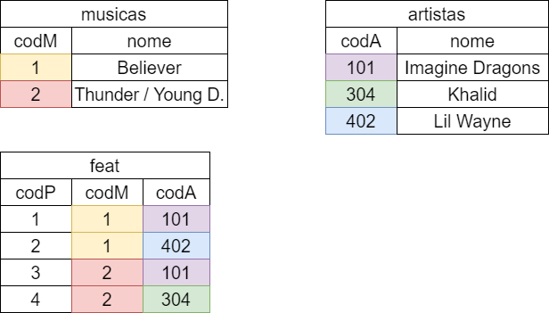

# # Relacionamento N para N

A partir do exemplo dos slides:

Temos as três tabelas:

    CREATE TABLE musicas(
        codM INTEGER PRIMARY KEY AUTOINCREMENT,
        nome TEXT
    );

    CREATE TABLE artistas(
        codA INTEGER PRIMARY KEY AUTOINCREMENT,
        nome TEXT
    );

    CREATE TABLE feats(
        codF INTEGER PRIMARY KEY AUTOINCREMENT,
        codM INTEGER references musicas,
        codA INTEGER references artistas
    );

Começaremos criando as classes que representam essas entidades:

    class Artista {
        int codA;
        String nome;
        List<Musica> musicas = [];

        Artista();

        Artista.fromJson(Map<String, dynamic> json) {
            this.codA = json['codA'];
            this.nome = json['nome'];
        }
    }

    class Musica {
        int codM;
        String nome;
        List<Artista> artistas = [];

        Musica();

        Musica.fromJson(Map<String, dynamic> json) {
            this.codM = json['codM'];
            this.nome = json['nome'];
        }
    }

Em seguida, precisamos redefinir a classe BancoDeDados para que agora as tabelas sejam criadas usando os SQL's de criação definidos anteriormente:

    final String onCreateMusicas =
      'CREATE TABLE musicas(codM INTEGER PRIMARY KEY AUTOINCREMENT,nome TEXT);';

    final String onCreateArtistas =
        'CREATE TABLE artistas(codA INTEGER PRIMARY KEY AUTOINCREMENT,nome TEXT);';

    final String onCreateFeats =
        'CREATE TABLE feats(codF INTEGER PRIMARY KEY AUTOINCREMENT, codM INTEGER references musicas, codA INTEGER references artistas );';

    onCreateFunction(Database db, int version) {
        db.execute(onCreateMusicas);
        db.execute(onCreateArtistas);
        db.execute(onCreateFeats);
    }

    BancoDeDados._internal() {
        getDatabasesPath().then((value) {
            String path = value += 'exemplo4.db';
            openDatabase(
                path,
                version: 1,
                onCreate: onCreateFunction,
            ).then((value) {
                db = value;
            });
        });
    }

Agora, começaremos a criar os Repository's. Para esse tipo de relacionamento, há duas formas de se fazer, na verdade existem outras, porém iremos fazer com que a classe MusicasRepository administre a tabela **feats**. Tanto que nem faremos na classe ArtistasRepository um método **selectAll()**, apenas faremos na classe MusicasRepository.

Começaremos na classe ArtistasRepository implementando o método **select()**, tal método irá buscar um artista dado um codA:

    class ArtistasRepository {

        final String sqlSelect = 'select * from artistas where codA = ?';

        Future<Artista> select(int codA) async {
            Artista a;
            await BancoDeDados.instance.db.rawQuery(sqlSelect, [codA]).then((value) {
                value.forEach((element) {
                    a = Artista.fromJson(element);
                });
            });
            return a;
        }
        ...
    }

Note que não fizemos nada tão diferente do que já temos visto até agora. Faremos agora na classe MusicasRepository, um método **selectFeat()** que usaremos em nosso método **selectAll()**. Tal método irá buscar os artistas que participam da música. Logo o método irá retornar uma lista de codA:

    class MusicasRepository {

        ArtistasRepository artistasRepository = ArtistasRepository();

        final String sqlSelectFeat = 'select * from feats where codM = ?';

        Future<List<int>> selectCodAMusicas(int codM) async {
            List<int> codAs = [];
            await BancoDeDados.instance.db
                .rawQuery(sqlSelectFeat, [codM]).then((value) {
                value.forEach((element) {
                    codAs.add(element['codA']);
                });
            });
            return codAs;
        }
        ...
    }

É utilizando desse método que iremos fazer o relacionamento N:N no método **selectAll()**:

    Future<List<Musica>> selectAll() async {
        List<Musica> musicas = [];
        await BancoDeDados.instance.db.rawQuery(sqlSelect).then((value) async {
            for (int i = 0; i < value.length; i++) {
                List<int> codAs = await selectCodAMusicas(value[i]['codM'] as int);
                Musica m = Musica.fromJson(value[i]);
                for (int j = 0; j < codAs.length; j++) {
                    Artista a = await artistasRepository.select(codAs[i]);
                    m.artistas.add(a);
                }
                musicas.add(m);
            }
        });
        return musicas;
    }

Note que o método primeiro busca todas as músicas na tabela musicas. Logo após ela chama o método **selectCodAMusicas()** usando do id da música para poder buscar os artistas associados a essa música na tabela feats. Finalizando por chamar o método **select()** na classe ArtistasRepository.

A parte mais "chata" da implementação N:N já passou, tanto que para esse exemplo nem iremos implementar os métodos de **update()** visto que não há nenhuma novidade.

Faremos em seguida os métodos de **insert()**, criando um para cada classe e um terceiro na classe MusicasRepository para criar novos feats:

    final String sqlInsert = 'insert into musicas (nome) values (?);';

    Future<void> insert(Musica musica) async {
        await BancoDeDados.instance.db.rawInsert(sqlInsert, [musica.nome]);
    }

    final String sqlInsertFeats = 'insert into feats (codM,codA) values (?,?);';

    Future<void> inserirFeat(int codM, int codA) async {
        await BancoDeDados.instance.db.rawInsert(sqlInsertFeats, [codM, codA]);
    }

Já o da classe ArtistasRepository tem a seguinte implementação:

    final String sqlInsert = 'insert into artistas (nome) values (?);';

    Future<void> insert(Artista artista) async {
        await BancoDeDados.instance.db.rawInsert(sqlInsert, [artista.nome]);
    }

Nada muito diferente do que já vinhamos fazendo até agora.

Agora faremos os métodos de **delete()**, a única diferença com o que haviamos feito até anteriormente é que agora iremos excluir da tabela feats ao deletar uma música ou artista. Começaremos na classe MusicasRepository:

    final String sqlDelete = 'delete from musicas where codM = ?';
    final String sqlDeleteFeats = 'delete from feats where codM = ?';

    Future<void> delete(Musica musica) async {
        await BancoDeDados.instance.db.rawDelete(sqlDelete, [musica.codM]);
        await BancoDeDados.instance.db.rawDelete(sqlDeleteFeats, [musica.codM]);
    }

Na ArtistasRepository, a mesma lógica:

    final String sqlDelete = 'delete from artistas where codA = ?';
    final String sqlDeleteFeats = 'delete from feats where codA = ?';

    Future<void> delete(Artista artista) async {
        await BancoDeDados.instance.db.rawDelete(sqlDelete, [artista.codA]);
        await BancoDeDados.instance.db.rawDelete(sqlDeleteFeats, [artista.codA]);
    }